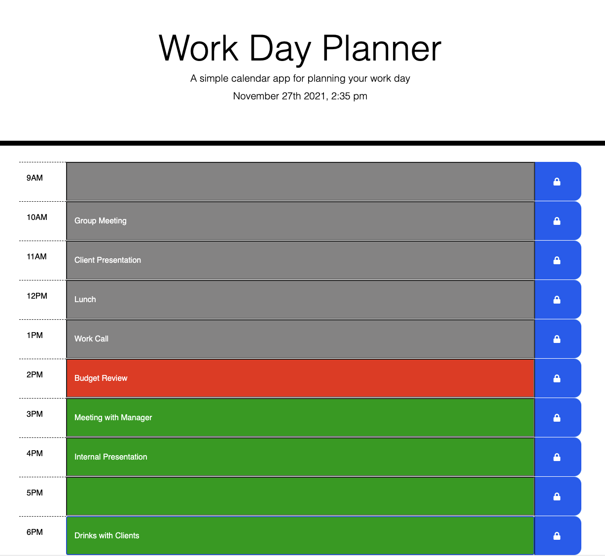

# work_day_planner
A simple work calendar designed to save events for each hour of the day. 

HOW IT WORKS:
In this application the user can view the current day and time while also planning their workday. The user is presented with timeblocks for standard business hours and each timeblock is color coded to indicated whether it is in the past, present, or future. When the user clicks on a timeblock, they are able to enter and save an event. The event will remain on the screen even if they refresh the page. Happy planning!

GitHub repository for my Password Generator: https://github.com/SarahLabrotLientz/work_day_planner

URL to live website: https://sarahlabrotlientz.github.io/work_day_planner/

Coding languages: HTML, CSS, JavaScript